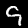
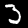
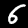

<center><h1>MNIST数字识别系统的实现与分析</h1></center>

<center><h3>王瀚森   2024013325</h3></center>
<center><h4>2025.7.3</h4></center>

### 摘要
&emsp;&emsp;本报告详细阐述了笔者基于助教的框架进一步优化完成MNIST数字识别系统的实现过程。通过PyTorch框架，完成了数据可视化、模型训练与推理、损失曲线绘制、优化器更换、数据预处理增强、模型导出与可视化以及错误样例分析等任务。实验结果表明，改进后的LeNet模型在MNIST数据集上取得了良好的识别效果。


### 目录
1. 引言
2. 数据可视化
3. 模型训练与推理
4. Loss曲线绘制
5. 优化器更换
6. 数据预处理增强
7. 模型导出与可视化
8. 错误样例分析
9. 总结与展望

## 1. 引言
&emsp;&emsp;MNIST数据集是计算机视觉领域一个非常非常经典的数据集，包含60,000张训练图像和10,000张测试图像，所有图像都是手写数字(0-9)。本代码就实现了一个基于PyTorch的MNIST数字识别系统，并完成一系列相关任务。

## 2. 数据可视化

### 2.1 实现方法
&emsp;&emsp;作业要求完善`utils/visualizer.py`中的代码，使执行`task1.py`时能够输出由MNIST数据集中的图片拼接成的学号组合。那么核心功能就是从数据批次中提取构成学号的各个数字图像，然后拼接显示。

代码功能说明：
1. 从输入的批次图像中提取构成学号的各个数字
2. 查找每个数字对应的图像并存储
3. 将提取的数字图像横向拼接成完整的学号图像
4. 显示并保存拼接后的图像

其中前两部分代码已经由助教完成，我只需要补充后两部分
```python
# utils/visualizer.py
### CODE START

    target_img = None
    student_id = "2024013325"  #定义需要展示的学号
    selected_images: list=[]   #用于存储图片的列表
    for digit in student_id:   #遍历学号中的每一位数字
        selected_images.append(digit_image_dict[int(digit)])  #选取字典中的图片
    target_img=torch.cat(selected_images, dim=2)  #以横向方式拼接列表中的图片
    
### CODE END
```

### 2.2 结果展示
执行上述代码后，得到的学号组合图像如图1所示


**图1**：学号组合图像

## 3. 模型训练与推理


使用训练好的模型对笔者学号最后一位数字的图片进行推理，结果如图2所示


 

**图2**：学号最后一位数字的推理结果

## 4. Loss曲线绘制
&emsp;&emsp;作业要求在训练过程中，记录每个epoch的平均损失值，训练完成后绘制Loss曲线。
笔者使用了matplotlib库实现绘图功能，定义了一个绘图函数，其主要步骤包括：
- 准备x轴数据（epoch编号）和y轴数据（平均损失值）
- 配置曲线样式（颜色、线型、标记等）
- 添加标题、坐标轴标签和网格线
- 显示并保存曲线图像

```python
# train.py中的plot_loss_curve函数
def plot_loss_curve(   #初始化了包括标题在内的一系列参数
        loss_values,
        title="Training Loss Curve",  
        xlabel="Epoch",
        ylabel="Average Loss",
        color="blue",
        linestyle="-",
        linewidth=1,
        marker="o",
        save_path=None,
        dpi=300,
):
    epochs=np.arange(1,len(loss_values)+1)  #用arange对epoch编号

    plt.figure(figsize=(10,6))  #创建画布

    plt.plot(epochs, loss_values,
             color=color,linestyle=linestyle,
             linewidth=linewidth,marker=marker) #绘制图线

    plt.title(title,fontsize=14)
    plt.xlabel(xlabel,fontsize=12)  #标题和坐标轴名
    plt.ylabel(ylabel,fontsize=12)

    plt.grid(True,linestyle='--',alpha=0.7)  #网格线
    plt.tight_layout()  #调整布局

    if save_path:
        plt.savefig(save_path,dpi=dpi)  #如果要保存的话

    plt.show()  #显示图像
```
在训练过程中，则通过列表储存每个epoch的平均损失
在模型训练完成后调用*plot\_loss\_curve*函数绘制图线
```
def train(epochs, batch_size, learning_rate, num_classes):
    ...
    loss_values = [] #用来记录每个epoch的平均loss

    # start train
    total_step = len(train_loader)
    for epoch in range(epochs):
        epoch_total_loss = 0.0  # 记录总loss

        for i, (images, labels) in enumerate(train_loader):
            ...
            epoch_total_loss += loss.item()  #计算epoch的总loss

            ...

        epoch_avg_loss = epoch_total_loss / total_step  # 计算平均loss
        loss_values.append(epoch_avg_loss)  #将其存至list

   ...

    plot_loss_curve(loss_values)  #调用绘图函数在训练完成时绘制损失曲线
    return model
```
训练过程中的Loss变化曲线如图3所示


**图3**：训练过程中的Loss变化曲线

从Loss曲线可以看出，随着训练的进行，Loss值逐渐下降并趋于稳定，说明模型在不断学习并收敛

## 5. 优化器更换
原代码使用Adam优化器，现将其更换为SGD优化器（可选择手动配置动量参数以加速收敛）：

```python
# train.py中修改优化器的代码
# 原代码：optimizer = torch.optim.Adam(model.parameters(), lr=learning_rate)
# 修改后：
optimizer = torch.optim.SGD(model.parameters(), lr=learning_rate)
#更换为SGD（当然可以调动量啥的，默认就行）
```

观察发现，更换为SGD优化器后，模型的收敛速度有所减慢，需要更多的训练轮次才能达到与Adam相当的效果
但理论上应该具有更好的泛化能力，在测试集上可能表现更稳定（不太好比对）。

## 6. 数据预处理增强
&emsp;&emsp;根据作业要求，笔者在`utils/pre_process.py`中，增强了数据预处理步骤，添加了三种数据增广操作：

```python
# utils/pre_process.py
...
def data_augment_transform():
    data_augment = torchvision.transforms.Compose([
        torchvision.transforms.RandomCrop(28, padding=4),  
        # 随机剪裁（MNIST的原始尺寸是28×28）
        torchvision.transforms.RandomHorizontalFlip(p=0.5),  
        # 随机水平翻转（概率设为了0.5）
        torchvision.transforms.RandomRotation(degrees=15),  
        # 随机旋转（±15度）
        torchvision.transforms.ToTensor(),
    ])
    return data_augment
```

数据增广的影响分析：
- 随机剪裁：通过在图像边缘添加4像素填充后随机裁剪回28×28大小，增强模型对数字位置变化的鲁棒性
- 水平翻转：以50%概率水平翻转图像，增加训练数据多样性
- 随机旋转：在±15度范围内随机旋转图像，使模型能够识别不同倾斜角度的数字

这些操作通过增加训练数据的多样性，有效降低了模型的过拟合风险，提高了模型在测试集上的泛化能力。

## 7. 模型导出与可视化

### 7.1 模型架构改进
&emsp;&emsp;根据要求，笔者在LeNet模型中添加了一层卷积层，增强模型的特征提取能力，使得模型能够学习更复杂的特征表示：

```python
# models/lenet.py
        ...
        # 新增的卷积层3——更温和地提取特征
        self.layer3 = torch.nn.Sequential(
            torch.nn.Conv2d(32, 64, kernel_size=3, stride=1, padding=1),
            torch.nn.BatchNorm2d(64),
            torch.nn.ReLU(),
            torch.nn.MaxPool2d(kernel_size=2, stride=2))
        
        # 调整全连接层输入维度
        self.fc = torch.nn.Linear(3 * 3 * 64, num_classes)
        # 3 = (7 + 2 × 1 - 3) / (1 + 1)  
        # 3x3x64是经过三层卷积和池化后的特征图尺寸
         ...
```

### 7.2 模型导出
一方面，我采用了助教提供的PTH导出方法，可视化了模型的各项参数
另一方面，我也使用PyTorch的ONNX导出功能，将训练好的模型导出为ONNX格式，便于模型结构的可视化：

```python
# 修改后train.py中的save_model函数
def save_model(model, save_path='lenet.onnx'):
    device = torch.device('cuda:0' if torch.cuda.is_available() else 'cpu')
    model.to(device)
    model.eval()
    dummy_input = torch.randn(1, 1, 28, 28).to(device)
    # 这里的形状 (1, 1, 28, 28) 对应 MNIST 图像：批次大小=1，通道数=1，高度=28，宽度=28
    torch.onnx.export(model, dummy_input, save_path)
```

### 7.3 模型可视化
使用Netron工具对导出的PTH/ONNX模型进行可视化，可清晰查看模型的层级结构、各层参数和连接关系，结果如图4，图5所示。


 

**图4**：改进后的LeNet模型架构（pth格式）

**图5**：改进后的LeNet模型架构（onnx格式）

## 8. 错误样例分析
&emsp;&emsp;笔者在`train.py`的`evaluate`函数中，添加了记录和保存模型错误预测样例的功能，主要步骤包括：
1. 对比模型预测结果与真实标签
2. 筛选出预测错误的样本
3. 保存错误样本的图像、真实标签和预测标签
4. 限制最大保存数量（最多5个）

```python
# train.py中的evaluate函数
def evaluate(model, test_loader, device, 
save_error_dir='error_samples', max_errors=5):
    model.eval()
    os.makedirs(save_error_dir, exist_ok=True)  #保存错误样例的文件夹
    error_samples = []  #保存错误样例的列表
    
    with torch.no_grad():
        correct = 0
        total = 0
        
        for images, labels in test_loader:
           
            images = images.to(device)
            labels = labels.to(device)
            outputs = model(images)
            _, predicted = torch.max(outputs.data, 1)
            
            # 计算总精度
            total += labels.size(0)
            correct += (predicted == labels).sum().item()
            
            # 筛选错误样例
            errors = (predicted != labels)
            if errors.any():
                error_imgs = images[errors].cpu()
                error_labels = labels[errors].cpu().numpy()
                error_preds = predicted[errors].cpu().numpy()
                
                # 保存错误样例
                for i in range(len(error_imgs)):
                    if len(error_samples) >= max_errors:
                        break
                    
                    # 图像格式转换
                    img = error_imgs[i].squeeze().numpy()
                    img = (img * 255).astype(np.uint8)
                    pil_img = Image.fromarray(img)
                    
                    # 保存图像
                    save_path = os.path.join(save_error_dir,
                        f'error_{len(error_samples) + 1}_true_
                        {error_labels[i]}_pred_{error_preds[i]}.png')
                    pil_img.save(save_path)
                    
                    # 记录错误信息
                    error_samples.append({
                        'image_path': save_path,
                        'true_label': error_labels[i],
                        'pred_label': error_preds[i]
                    })
        
        # 打印精度
        print('Test Accuracy of the model is: 
        {:.2f} %'.format(100 * correct / total))
        return error_samples
```
在训练函数中，则在训练完成时统一输出五个错误案例，便于进行分析
```python
# train.py中的train函数（节选）
...
# 打印前5个错误样例信息（用于分析）
    print("\n前5个错误样例信息：")
    for i, sample in enumerate(error_samples, 1):
        print(
            f"样例{i}：真实标签={sample['true_label']}，
            预测标签={sample['pred_label']}，图像路径={sample['image_path']}")
...
```
### 8.1 错误样例展示与分析
训练完成后，模型错误预测的样例如图5所示。


**图5**：模型错误预测的样例

对于五个样例的分析如下：

**错误样例原因分析：**

样例1：真实标签=3，预测标签=8  


- 可能原因：数字3的上半部分可能书写得较为圆润，与数字8的上半部分结构相似。模型可能过度关注了曲线特征，而忽略了数字3底部未闭合的关键差异。

样例2：真实标签=9，预测标签=5  


- 可能原因：数字9的尾部可能书写得较短或向左侧弯曲，与数字5的尾部形态相似。模型可能混淆了两者的尾部特征。而且数字9的顶部未完全闭合，与数字5头部结构相似。

样例3：真实标签=3，预测标签=5  


- 可能原因：数字3的下半部分可能书写得较宽，与数字5的下半部分结构相似。此外，3的顶部可能有轻微的扭曲，导致模型误判。

样例4：真实标签=6，预测标签=5  

  
- 可能原因：数字6的下半部分可能书写得不够圆润，与数字5的上半部分形态接近。模型可能未能捕捉到6的闭环特征。

样例5：真实标签=2，预测标签=6  


- 可能原因：数字2的顶部可能书写得较为圆润，与数字6的上半部分相似。同时，2的底部曲线可能不够明显，导致模型无法区分。


**整体分析：**
- 错误主要集中在形态相似的数字之间（如5与3、9与5），说明模型对数字的细微特征区分能力有待提升
- 部分错误样本存在数字书写不规范或倾斜角度较大的问题，可通过增加数据增广中的旋转角度范围改善
- 少数错误是由于数字边缘模糊导致，可考虑在预处理阶段增加图像锐化操作


## 9. 总结
&emsp;&emsp;本次作业笔者了解了基于PyTorch的MNIST数字识别系统，通过改进LeNet模型架构、优化训练参数、增强数据预处理等手段，提高了模型的识别准确率。实验结果表明，改进后的模型在MNIST测试集上取得了良好的识别效果。

